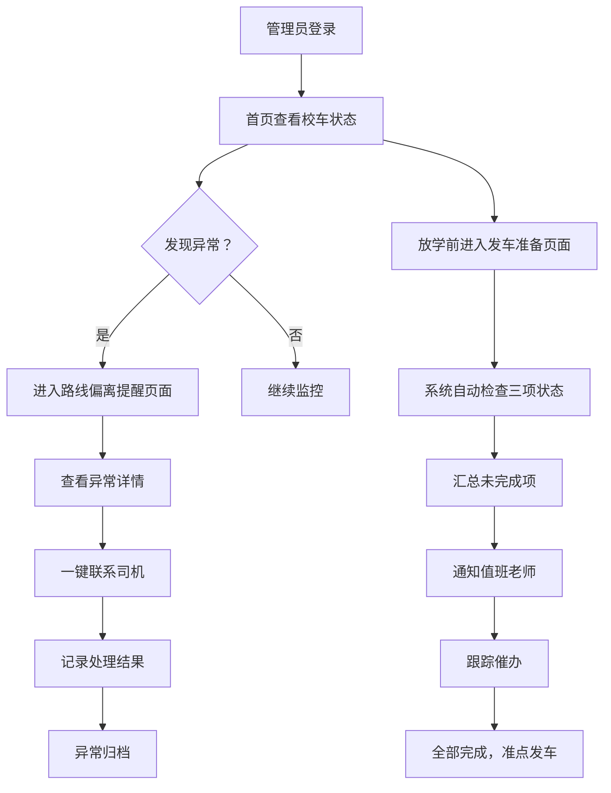

## 1. 产品概述

校车实时护航台是一款面向学校校车管理员的 Web 端管理系统，旨在全面管控早晚学生接送过程，提升校车运营安全与效率。

- **核心价值**：从"看地图"升级为"管过程"，实现校车全程可视化、异常预警自动化、发车检查制度化
- **目标用户**：学校校车管理员、值班老师、后勤主任
- **使用场景**：每日早高峰接学生到校、晚高峰送学生回家的全程管控

## 2. 核心功能

### 2.1 用户角色

| 角色 | 核心权限 |
|------|----------|
| 校车管理员 | 查看全部校车实时状态、处理路线偏离预警、发车前检查、联系司机、记录处理结果 |
| 值班老师 | 查看未完成发车检查项、接收汇总提醒 |

### 2.2 功能模块

1. **首页实时护航台**：校车地图总览、车辆卡片列表、多维筛选、车辆详情抽屉
2. **路线偏离提醒**：异常预警卡片、一键联系司机、处理结果记录、异常历史
3. **放学前准备**：发车检查清单、未完成项自动汇总、司机发车确认、值班老师通知

### 2.3 页面详情

| 页面名称 | 模块名称 | 功能描述 |
|-----------|-------------|---------------------|
| 首页实时护航台 | 顶部概览统计 | 显示在线车辆数、总人数、异常预警数、迟到风险数 |
| 首页实时护航台 | 多维筛选栏 | 按年级、线路、迟到风险三个维度筛选车辆 |
| 首页实时护航台 | 校车地图视图 | 地图上标注所有校车实时位置，不同状态不同颜色 |
| 首页实时护航台 | 校车卡片列表 | 展示车牌、司机、照管员、车内人数、当前线路、状态标签 |
| 首页实时护航台 | 车辆详情抽屉 | 下一站名称、预计到站时间、已上车学生名单（含年级班级） |
| 路线偏离提醒 | 异常预警卡片 | 红色醒目卡片，显示车牌号、异常类型、发生时间、位置 |
| 路线偏离提醒 | 异常类型标签 | 路线偏离/长时间停留/接近禁停区域，不同颜色区分 |
| 路线偏离提醒 | 一键联系司机 | 点击按钮拨打电话或发送即时消息 |
| 路线偏离提醒 | 处理结果记录 | 填写处理措施、备注、处理人签名、处理时间 |
| 路线偏离提醒 | 异常历史列表 | 已处理异常的历史记录，支持筛选和查看详情 |
| 放学前准备 | 发车检查清单 | 车辆是否上线、定位是否正常、司机是否确认发车，每车逐项检查 |
| 放学前准备 | 检查状态标签 | 已完成/未完成/异常，不同颜色和图标 |
| 放学前准备 | 未完成项汇总 | 自动汇总所有未完成项，按车辆分组展示 |
| 放学前准备 | 值班老师通知 | 一键将未完成清单发送给值班老师 |
| 放学前准备 | 司机确认按钮 | 模拟司机端确认发车操作入口 |

## 3. 核心流程

### 3.1 早间护航流程

管理员登录系统 → 首页查看所有校车实时位置 → 通过筛选快速定位高风险车辆 → 点击车辆查看详情 → 关注下一站到站时间和学生上车情况 → 发现异常跳转至路线偏离页面处理

### 3.2 异常处理流程

系统检测到路线偏离/停留超时/接近禁停区 → 路线偏离页面生成红色预警卡片 → 管理员点击"联系司机" → 沟通后填写处理结果 → 异常标记为已处理 → 自动记录到异常历史

### 3.3 放学前检查流程

放学前 30 分钟系统自动启动检查 → 逐车检查上线状态、定位状态、司机确认状态 → 自动汇总未完成项 → 管理员发送给值班老师 → 值班老师跟踪催办 → 全部完成后校车准点发车

## 4. 用户界面设计

### 4.1 设计风格

- **主色调**：深海蓝 `#0F2A4A`（专业、可靠），搭配警戒红 `#E63946`（预警）、安全绿 `#2A9D8F`（正常）、警示橙 `#F4A261`（警告）
- **辅助色**：石板灰 `#4A5568`、浅灰蓝 `#E2E8F0`
- **按钮风格**：圆角 8px，实心主按钮 + 描边次按钮，hover 有阴影和微上浮效果
- **字体**：标题使用思源黑体 Bold，正文使用思源黑体 Regular，数字使用等宽字体
- **布局风格**：左侧导航栏 + 顶部状态栏 + 主内容区，卡片式布局，信息密度适中
- **图标风格**：使用 Lucide 线性图标，异常状态使用填充图标

### 4.2 页面设计概览

| 页面名称 | 模块名称 | UI 元素 |
|-----------|-------------|-------------|
| 首页实时护航台 | 顶部概览统计 | 4 个数据卡片，大号数字 + 标签 + 趋势箭头 |
| 首页实时护航台 | 多维筛选栏 | 下拉选择器 + 标签式筛选，选中高亮 |
| 首页实时护航台 | 校车地图视图 | 深色底地图，校车图标带动画脉冲，悬浮显示简介 |
| 首页实时护航台 | 校车卡片列表 | 网格布局，卡片带状态色边框，hover 上浮 |
| 首页实时护航台 | 车辆详情抽屉 | 右侧滑出，分层信息展示，学生名单带滚动 |
| 路线偏离提醒 | 异常预警卡片 | 红色左边框 + 背景渐变，大号异常类型标签 |
| 路线偏离提醒 | 处理结果记录 | 模态弹窗，表单式输入，必填项红星标记 |
| 放学前准备 | 发车检查清单 | 表格 + 卡片混合布局，每行三状态指示灯 |
| 放学前准备 | 未完成项汇总 | 顶部黄色警示条，带计数和一键发送按钮 |

### 4.3 响应式设计

- **设计优先级**：桌面端优先（管理员主要在电脑端使用）
- **适配断点**：1440px（标准桌面）、1024px（平板横屏）、768px（平板竖屏）
- **移动适配**：地图区域自适应缩放，卡片列表改为单列，筛选栏折叠收起
