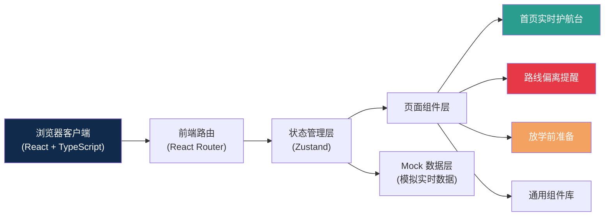
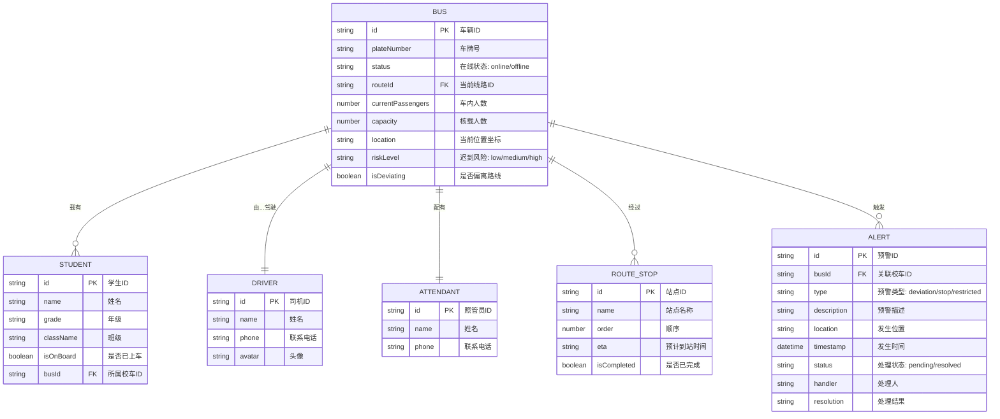

## 1. 架构设计



## 2. 技术说明

- **前端框架**：React 18 + TypeScript 5
- **构建工具**：Vite 5
- **样式方案**：Tailwind CSS 3 + CSS 变量
- **路由管理**：React Router DOM 6
- **状态管理**：Zustand（轻量级状态管理）
- **图标库**：Lucide React
- **后端**：纯前端 Mock 数据，模拟实时推送效果
- **地图**：使用 CSS + SVG 绘制简化地图（无需接入真实地图 API）

## 3. 路由定义

| 路由路径 | 页面名称 | 说明 |
|----------|----------|------|
| `/` | 首页实时护航台 | 默认首页，展示校车地图和列表 |
| `/alerts` | 路线偏离提醒 | 异常预警和处理记录 |
| `/preparation` | 放学前准备 | 发车前检查清单 |

## 4. 数据模型

### 4.1 数据模型定义



### 4.2 核心数据接口

```typescript
// 校车信息
interface Bus {
  id: string;
  plateNumber: string;
  driver: Driver;
  attendant: Attendant;
  currentPassengers: number;
  capacity: number;
  route: Route;
  status: 'online' | 'offline';
  riskLevel: 'low' | 'medium' | 'high';
  location: { lat: number; lng: number };
  nextStop?: RouteStop;
  students: Student[];
  isDeviating: boolean;
}

// 预警信息
interface Alert {
  id: string;
  busId: string;
  busPlateNumber: string;
  type: 'deviation' | 'stop' | 'restricted';
  description: string;
  location: string;
  timestamp: Date;
  status: 'pending' | 'resolved';
  handler?: string;
  resolution?: string;
  resolvedAt?: Date;
}

// 发车检查项
interface ChecklistItem {
  busId: string;
  plateNumber: string;
  isOnline: boolean;
  isGpsNormal: boolean;
  isDriverConfirmed: boolean;
  driverName: string;
  driverPhone: string;
}
```

## 5. 项目结构

```
src/
├── components/          # 通用组件
│   ├── Layout/          # 布局组件（导航、侧栏）
│   ├── BusCard/         # 校车卡片
│   ├── BusMap/          # 校车地图
│   ├── AlertCard/       # 预警卡片
│   ├── ChecklistRow/    # 检查清单行
│   ├── StatCard/        # 统计卡片
│   └── FilterBar/       # 筛选栏
├── pages/               # 页面
│   ├── Dashboard/       # 首页实时护航台
│   ├── Alerts/          # 路线偏离提醒
│   └── Preparation/     # 放学前准备
├── store/               # Zustand 状态管理
│   ├── busStore.ts      # 校车状态
│   ├── alertStore.ts    # 预警状态
│   └── checklistStore.ts # 检查清单状态
├── data/                # Mock 数据
│   ├── buses.ts         # 校车模拟数据
│   ├── alerts.ts        # 预警模拟数据
│   └── checklist.ts     # 检查清单数据
├── types/               # TypeScript 类型定义
│   └── index.ts
├── utils/               # 工具函数
│   └── format.ts
├── App.tsx              # 根组件
├── main.tsx             # 入口文件
└── index.css            # 全局样式和 Tailwind
```
